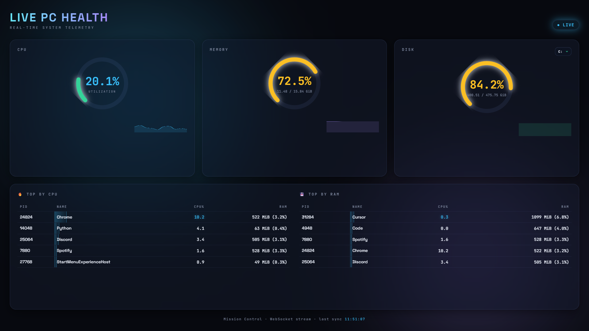

<div align="center">


<p>
  
  
  
  
  
</p>

<strong>A real-time telemetry dashboard that streams CPU, RAM, Disk, and Process stats from a Python backend to a glassmorphic browser UI over WebSockets.</strong><br/>


</div>

---

## 🖥️ Preview

<div align="center">



</div>

---

## ✨ Why Live PC Health

| Feature | Description |
|---------|-------------|
| ⚡ **Tiered Streaming** | Fast ticks (~400ms) for gauges and sparklines; full scans (~2s) refresh processes and disk list. |
| 🎛️ **SVG Radial Gauges** | Custom-built speedometer arcs for CPU, Memory, and Disk — smoothed client-side at ~60fps. |
| 📈 **Live Sparklines** | Rolling-window line charts via `Chart.js` for historical trend visualization. |
| 💾 **Multi-Disk Picker** | Dropdown to switch between mounted volumes; selection persists in `localStorage`. |
| 🔥 **Top Apps** | Top CPU and RAM consumers grouped by executable (e.g. all `chrome.exe` PIDs → one Chrome row). |
| 🔄 **Auto-Reconnect** | Seamless frontend reconnection if the backend server restarts. |
| 🌐 **Cross-Platform** | Built on `psutil`, with OS-specific CPU normalization and memory metrics where it matters. |

The interface adopts a premium **"Mission Control"** aesthetic: an animated gradient mesh background, glassmorphism panels, and neon threshold colors that shift from **green** to **amber** to **red** as utilization climbs.

---

## 🏗️ Architecture

The project is split into a Python data-gathering backend and a static HTML/JS frontend, connected by a live WebSocket stream.

### How the data flows

1. The **browser** loads the dashboard via HTTP (`GET /`).
2. `app.js` opens a **WebSocket** connection to `/ws`.
3. The backend runs a **tiered loop** per connected client:
   - **Fast ticks** (~400ms): `interval=None` CPU, RAM, system disk, and refreshed usage on cached volumes.
   - **Full ticks** (~every 2s): blocking 1s CPU sample, process scan, and disk enumeration.
4. Each payload includes an optional `"tick": "fast" | "full"` field; gauges update every tick, process tables on full ticks.
5. **FastAPI** pushes JSON over the socket; the **UI** lerps gauge values, updates sparklines, and re-renders process rows.

---

## 📂 Project Structure

```text
live-pc-dashboard/
├── backend/
│   ├── stats.py            # psutil metrics, tiered collectors, process grouping
│   ├── win_memory.py       # Windows Private Working Set (Task Manager alignment)
│   ├── verify_metrics.py   # CLI sanity check vs OS monitor
│   └── main.py             # FastAPI app + WebSocket endpoint + static file server
├── frontend/
│   ├── index.html          # Dashboard layout, SVG gauges, disk dropdown
│   ├── style.css           # Dark theme, glassmorphism, and animations
│   └── app.js              # WebSocket client, Chart.js, gauge smoothing, disk picker
├── docs/                   # Documentation assets
├── start.bat               # Windows quick start (cmd)
├── start.ps1               # Windows quick start (PowerShell)
├── start.sh                # macOS / Linux quick start
├── requirements.txt        # Python dependencies
└── README.md               # This file
```

---

## 🚀 Getting Started

### Quick start (recommended)

From the project root:

| Platform | Command |
|----------|---------|
| **Windows (cmd)** | `start.bat` |
| **Windows (PowerShell)** | `.\start.ps1` |
| **macOS / Linux** | `chmod +x start.sh` once, then `./start.sh` |

Each script creates a `venv` if needed, installs dependencies, and starts the server at **http://127.0.0.1:8000**. Open that URL in your browser.

### Manual setup

#### 1. Prerequisites

Ensure you have **Python 3.10+** installed on your system.

#### 2. Set up a virtual environment

It is recommended to run the project inside an isolated virtual environment.

**Windows (cmd / PowerShell):**
```bat
cd live-pc-dashboard
python -m venv venv
venv\Scripts\activate
```

**macOS / Linux:**
```bash
cd live-pc-dashboard
python3 -m venv venv
source venv/bin/activate
```

#### 3. Install dependencies

```bash
pip install -r requirements.txt
```

#### 4. Run the server

Start the backend from the **project root** so module imports and static files resolve correctly.

```bash
uvicorn backend.main:app --reload
```

You should see:
```text
INFO:     Uvicorn running on http://127.0.0.1:8000 (Press CTRL+C to quit)
```

#### 5. Launch

Open your browser and navigate to 👉 **[http://127.0.0.1:8000](http://127.0.0.1:8000)**

---

## 🌍 Cross-Platform Notes

| Topic | Behavior |
|-------|----------|
| **CPU %** | Per-process CPU is divided by logical core count (0–100% of the whole machine), matching the system gauge and Windows Task Manager. |
| **Storage labels** | Sizes use **GiB** (binary, ÷ 1024³), not marketing GB. |
| **Process memory** | **Windows:** Private Working Set via Win32 API (`win_memory.py`). **Linux / macOS:** RSS (same idea as `top` / `htop` RES). |
| **RAM total** | OS-reported GiB may differ slightly from hardware sticker RAM (reserved memory, firmware). |

---

## ✅ Verification

Compare dashboard output with your OS monitor:

```bash
python -m backend.verify_metrics
```

- **Windows:** Task Manager → Details → Memory column = Private Working Set.
- **Linux:** `top` / `htop` (RSS); `df -h` for disks.
- **macOS:** Activity Monitor.

The script prints a full snapshot (CPU, RAM, all disks, grouped top apps) plus a fast tick sample.

---

## ⚠️ Limitations

- **Local only** — binds to `127.0.0.1`; no auth, no remote access.
- **Single-user** — one machine, one browser session; not a fleet monitor.
- **Approximate, not pixel-perfect** — sampling intervals and grouping differ from Task Manager / `htop`; use for at-a-glance trends, not forensic accuracy.
- **Privileged processes** — some system PIDs are skipped (`AccessDenied`); rankings reflect what `psutil` can read.

---

## 🛠️ Tech Stack

- **Backend:** [Python](https://www.python.org/), [FastAPI](https://fastapi.tiangolo.com/), [psutil](https://psutil.readthedocs.io/en/latest/)
- **Server:** [Uvicorn](https://www.uvicorn.org/) (ASGI)
- **Frontend:** HTML5, CSS3 (CSS variables, Flexbox/Grid), Vanilla JavaScript
- **Charting:** [Chart.js](https://www.chartjs.org/)
---

## 📄 License

This project is open-source and available under the **MIT License**.

## 🌱 A Note from the Author

This is one of my **first projects**. I'm still learning, so the code
may not always follow best practices.

If you spot a bug, a mistake, or something that could be done better, please
**open an issue** or leave a comment — any feedback is genuinely appreciated
and helps me grow as a developer. Thank you for checking it out! 🙏
